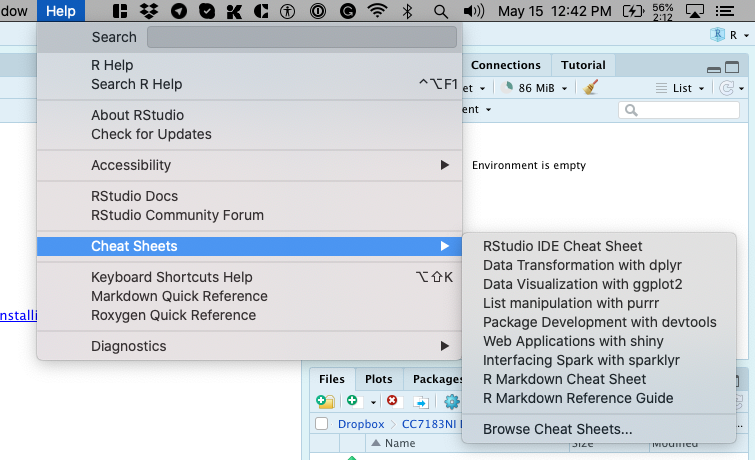
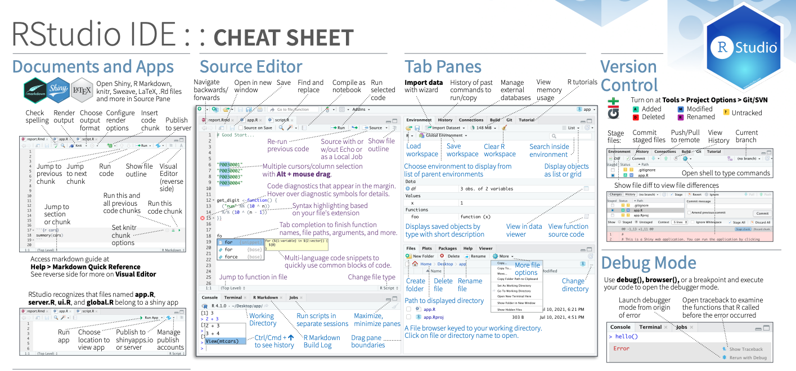
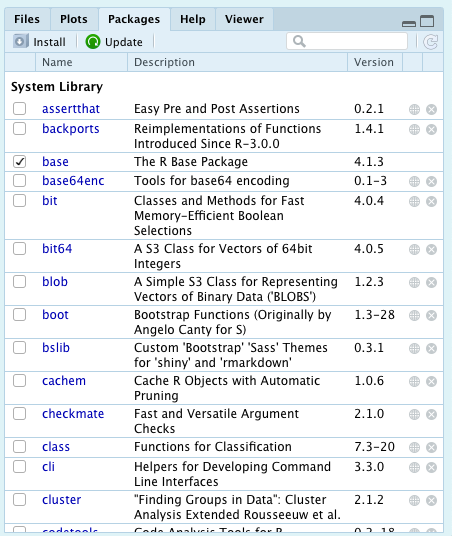

# Data Science: R Basics

This is an [R Markdown](http://rmarkdown.rstudio.com) Notebook. When you execute code within the notebook, the results appear beneath the code.

Try executing this chunk by clicking the *Run* button within the chunk or by placing your cursor inside it and pressing *Cmd+Shift+Enter*.

```{r}
plot(cars)
```

Add a new chunk by clicking the *Insert Chunk* button on the toolbar or by pressing *Cmd+Option+I*.

When you save the notebook, an HTML file containing the code and output will be saved alongside it (click the *Preview* button or press *Cmd+Shift+K* to preview the HTML file).

The preview shows you a rendered HTML copy of the contents of the editor. Consequently, unlike *Knit*, *Preview* does not run any R code chunks. Instead, the output of the chunk when it was last run in the editor is displayed.

## Installation and Setup

-   Install Latest R from - (<https://cran.r-project.org>)
-   Install RStudio Free Desktop Version from- (<https://rafalab.github.io/dsbook/installing-r-rstudio.html#installing-rstudio>)

## Cheat Sheet



[](https://www.rstudio.org/links/ide_cheat_sheet)

## Textbook Link

Here is a link to the textbook section on [Getting Started External link](https://rafalab.github.io/dsbook/getting-started.html) with R.

## Package Installation



install.packages ("dslabs")

```{r}
library(dslabs)
```

[Basics.Rmd](Basics.Rmd)
